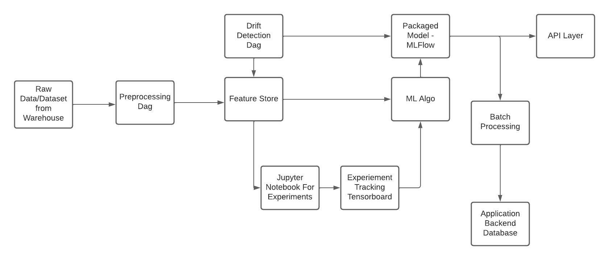

### Requirements and V1 Ideation:

1. Consider that a refined dataset exists in Data Warehouse, which is dumped after a ETL process has be ran and ready for consumption, this part will be done by [Modern Data Stack with Airflow + DBT + Great Expectations](https://github.com/nikeshnaik/modern_data_stack)

2. Since each model resides in its domain like retails and consumer segments, the features are different for each models and requires faster access. A feature store which can be a MongoDB or S3 or Redis will work. There are also specialized feature store.

3. ML Platform will have a over arching Workflow Orchestrator, for eg. Airflow. Above feature stoer will have DAG which will preprocess Raw Dataset to Feature. (Yes only after first model is trained and demo has reached accpetable level).

4. Since ML Model are prone to sliently fail in Production, we will have a Drift Detection Algorithms: To keep it simple in V1, we check labels and features mapping before updating data and after. Great Expectations Testing Suite will be beneficial here. For starting, we cen send a mail when drift is detected, but later stage retraining must be triggered.

5. For ML Algorithm Experiements, we have a Jupyter Notebook on local container and experiments tracker like Tensorboard. Models will be using MLFlow versioning.

6. Since output of ML Model can be directly ingested by Enterprise Application through API Layer or Batch Processing with Spark can be used.

### Final Goal:

Abstract away Machine Learning Engineering steps from DS work for faster iteration of ML Experiments.

## Preffered Tech Stack for V1:

1. AWS S3 for Feature Store
2. Airflow for Workflow Orch
3. Jupyter Notebook
4. Experiment Tracker
5. Batch Processing with Spark
6. Flask for API Layer.
7. Docker Container
